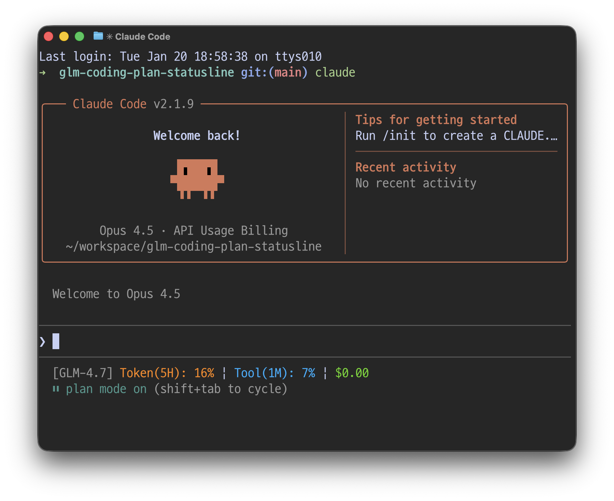

i# glm-coding-plan-statusline

> Claude Code용 GLM Coding Plan 사용량 모니터링 플러그인

이 플러그인은 Claude Code 하단에 GLM Coding Plan의 실시간 사용량 정보를 표시하는 스테이터스 라인을 제공합니다. Z.ai (Zhipu AI) API를 사용하여 토큰 사용량, Tool/MCP 사용량, 비용 추정 정보를 5초마다 자동으로 갱신합니다.



## 주요 기능

- **실시간 사용량 모니터링**: 5초마다 자동 갱신되는 사용량 정보
- **한눈에 보는 정보**: 모델명, 토큰 사용량(%) | Tool/MCP 사용량(%) | 누적 비용
- **멀티 플랫폼 지원**: Z.ai, Zhipu AI API 지원
- **컬러 출력**: ANSI 색상 코드로 가독성 향상
- **캐싱 지원**: 불필요한 API 호출 최소화

## 지원 모델

| Claude 모델 | GLM 모델 |
|------------|----------|
| Opus       | GLM-4.7  |
| Sonnet     | GLM-4.7  |
| Haiku      | GLM-4.5-Air |

자동으로 현재 사용 중인 Claude 모델에 맞는 GLM 모델을 표시합니다.

## Installation

### From Plugin Marketplace

```shell
/plugin marketplace add jeongsk/glm-coding-plan-statusline
/plugin install glm-coding-plan-statusline
/glm-coding-plan-statusline:setup
```

### Manual Installation

1. Clone the repository: `git clone https://github.com/jeongsk/glm-coding-plan-statusline.git ~/.claude/plugins/glm-coding-plan-statusline`
2. Run setup: `/glm-coding-plan-statusline:setup`
